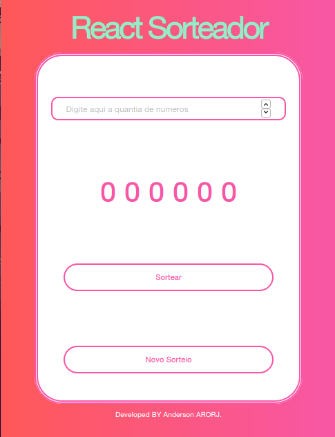
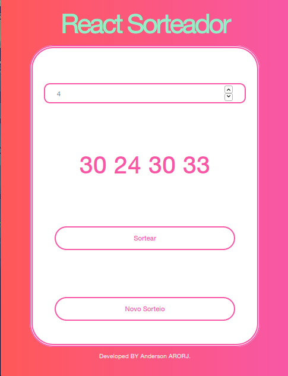

<h1 align="center">Welcome to React-Draw👋</h1>
<p>
  
  <a href="LICENSE" target="_blank">
    
  </a>
  <a href="https://twitter.com/andersonarorjdev" target="_blank">
    
  </a>
</p>


<h4>Simple, fast and beautifull, this tool was made to choose which one of your friends wiill pay the dinner.🍴 I promisse, will not you!🙅</h4>

> This tool was made to help you to choose random numbers, fast! 🎰🎲.


## Enjoy!🚀

<p align="center">
  
</p>

<p align="center">
  
</p>

***

## Downloading project⬇️
```sh
  git clone https://github.com/andersonarorjdev/React-Sorteador.git
```


## Install the Dependencies🖥

```sh
yarn install
```

## Starting the server to see the project👀

```sh
yarn run 
``` 

### Good luck! I realy hope that the choose wasn 't you!🏆🤞

## Author

👤 **Andersonarorjdev**

* Website: https://andersonarorjdev.github.io
* Twitter: [@andersonarorjdev](https://twitter.com/andersonarorjdev)
* Github: [@andersonarorjdev](https://github.com/andersonarorjdev)
* LinkedIn: [@andersonarorjdev](https://linkedin.com/in/andersonarorjdev)

## Show your support

Give a ⭐️ if this project helped you!

## 📝 License

Copyright © 2020 [Andersonarorjdev](https://github.com/andersonarorjdev).<br />
This project is [MIT](LICENSE) licensed.
